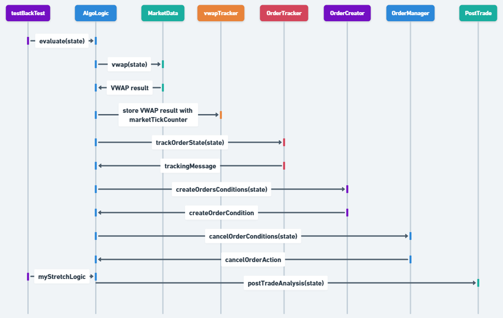

# Trading Algorithm Implementation

## Overview
This document outlines my implementation of a trading algorithm that creates and manages orders based on market conditions.

## Market Data Structure
- Market data is divided into 17 ticks (1 tick = 30 minutes) to reflect LSE trading time period.

## Trading Strategy
My algorithm implements the following strategy flow:

### Core Components
1. **VWAP Calculation**
   - `vwap(state)`: Calculates Volume Weighted Average Price
   - Stored in HashMap for historical reference linked to iteration

2. **Order State Tracking**
   - `trackOrderState(state)`: Monitors active orders duration within the Order book
   - Maintains order history in HashMap

3. **Order Creation Logic**
   - `createOrdersConditions(state)`: Generates buy/sell orders
   - Key criteria: Spread must be < 3 (indicating competitive market)
   - Staggers order placement between buy and sell sides

4. **Order Management**
   - `cancelOrderConditions(state)`: Monitors and cancels uncompetitive orders
   - A review of active order against the current market conditions

5. **Post-Trade Analysis**
   - `postTradeAnalysis(state)`: End-of-day performance metrics
   - Orders are then compared against VWAP day price to see if my orders have beaten the average.



### Order Creation Pseudocode
```java
if (activeOrders <= 2) {
    if (spreadPrice < 3 && nearTouchPrice < buyPriceLimit) {
        // Check for existing BUY orders
        if (activeBuyOrders < 1 && completedBuyOrders == 0) {
            setPrice = nearTouchPrice - 1
            initialQuantity = 100
            chosenQuantity = getLowestAskQuantityOnBook()
            setQuantity = min(initialQuantity, chosenQuantity)
            return new ChildOrder(BUY, setQuantity, setPrice)
        }
    }

    if (spreadPrice < 3 && farTouchPrice > askPriceLimit + 1) {
        // Check for existing SELL orders
        if (activeSellOrders < 1 && completedSellOrders == 0) {
            setPrice = farTouchPrice - 1
            setQuantity = 100
            return new ChildOrder(SELL, setQuantity, setPrice)
        }
    }
}
return NoAction
```

Key Features:
- Limits total active orders to 2
- Requires spread < 3 for order creation
- Implements price limits for both buy and sell sides
- Prevents duplicate orders on same side
- Manages quantity based on market conditions for buy orders
- Tracks completed orders to prevent over-trading

## Logging and Monitoring
The system provides detailed logging of:
- Current orderbook state
- Order lifecycle events (creation, fills, cancellations)
- Market data processing
- Order matching attempts

## Future Enhancements
1. Implement stop-loss mechanisms by recording and comparing previous market condition to predict next direction of instrument
2. Enhanced order creation logic based on execution history through testing different time periods in the past
3. Dynamic child order limit adjustments


